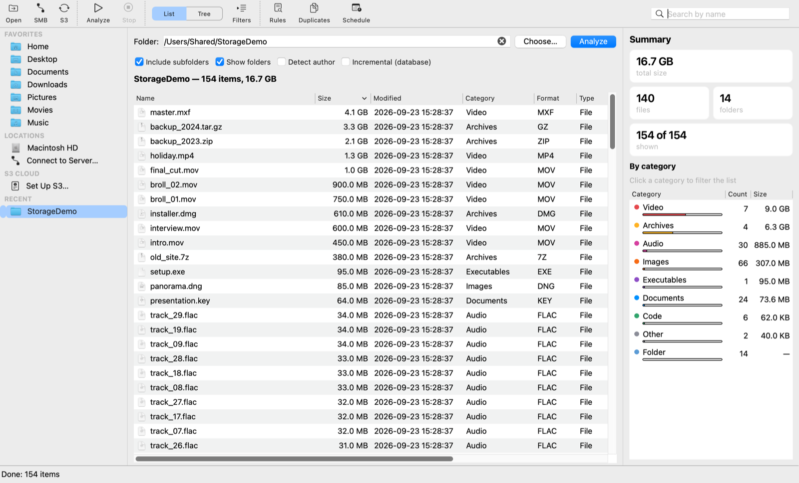
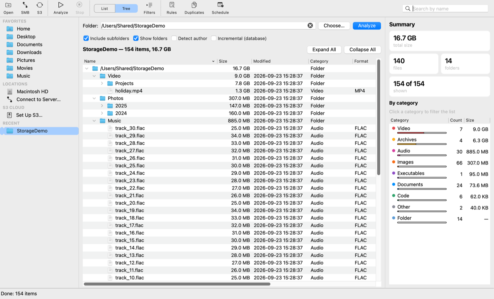
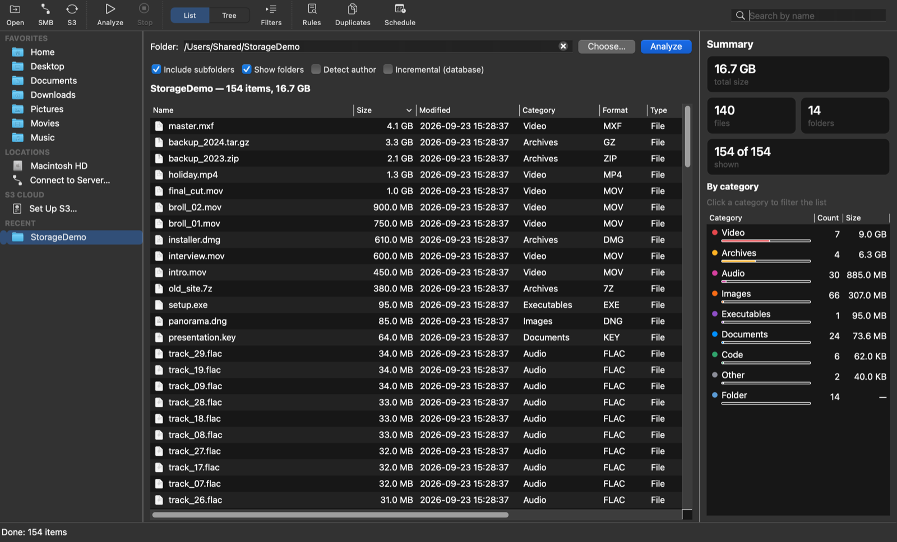

# Storage Analyzer

**A desktop app for analyzing what takes up space — on local disks, SMB network shares and S3 buckets.**

Storage Analyzer lists every file and folder (or S3 object) with its format, category, size,
dates and owner. You can then filter, browse the results as a flat list or as a folder tree
with folder sizes, find duplicates, and run rules such as "move files older than 6 months to
an archive" — once or on a schedule, with Telegram alerts when a folder grows too large.

Built with **Python + PySide6 (Qt)**. Runs on **macOS**, **Windows** and **Linux**.

> 🇷🇺 Русская версия описания: [README.ru.md](README.ru.md).



<table>
<tr>
<td></td>
<td></td>
</tr>
<tr>
<td align="center"><em>Folder tree with sizes</em></td>
<td align="center"><em>Dark mode</em></td>
</tr>
</table>

---

## Contents

- [Features](#features)
- [Installation](#installation)
- [Using the app](#using-the-app)
- [Keyboard shortcuts](#keyboard-shortcuts)
- [Building](#building)
- [Command line and automation](#command-line-and-automation)
- [Platform support](#platform-support)
- [Where data is stored](#where-data-is-stored)
- [How it works](#how-it-works)
- [Project structure](#project-structure)

---

## Features

- **Three kinds of sources in one app** — local folders and drives, SMB shares (Synology, QNAP,
  Windows servers…) and S3 buckets (AWS, MinIO, Ceph, Wasabi, Backblaze B2 and other
  S3-compatible storage).
- **Finder-style sidebar** — Favorites, drives and mounted volumes, S3 and recent folders.
  One click starts the analysis. You can also drag a folder onto the window.
- **Two views of the results**:
  - **List** — a flat table that sorts instantly by any column, even with 100,000+ rows;
  - **Tree** — the folder hierarchy with the **total size of every folder**. It is built
    lazily, so it opens instantly on huge folders.
- **Live filters** — search by name, format, category, type, author/owner, size range and
  modification date. Results update as you type.
- **Summary panel** — total size and file/folder counts, plus a per-category breakdown
  (Video, Images, Archives, Documents…) with size bars. Click a category to filter by it.
- **Actions on files** — open, Quick Look (macOS), reveal in Finder/Explorer, copy path,
  export the visible list to CSV. For S3: download, delete, move under a prefix, open via a
  presigned link.
- **Rules (condition → action)** — select files by age, size, format, category, name
  (contains / wildcard / regex), author, junk files (`Thumbs.db`, `.DS_Store`, `~$*`,
  `*.tmp`…) or empty files. Preview the matches, then move them to a folder (or, for S3,
  delete them or move them under a prefix).
- **Duplicate finder** — compare files by name, size, author, creation date and/or **content
  hash**. Keeps one file per group (the oldest) and moves the rest to a separate folder.
- **Incremental analysis** — snapshots are saved to a local SQLite database. When you rescan,
  only files that changed are re-read.
- **Scheduling** — background analysis and auto-archiving by rule, using the native scheduler:
  Task Scheduler on Windows, `launchd` on macOS, `cron` on Linux.
- **Telegram notifications** when a folder or bucket exceeds a size threshold.
- **English interface** on every platform. Rules saved by older versions with the Russian
  interface keep working: their units and categories are converted when loaded.
- **Native look on macOS** — menu bar and ⌘ shortcuts, unified toolbar, SF Symbols and Finder
  icons, light and dark mode, and the app remembers the window layout and settings.

---

## Installation

### macOS

1. Build the app (see [Building → macOS](#macos-1)), or take `FolderAnalyzer-<version>.dmg`
   from the project's Releases if it has been published there.
2. Open the `.dmg` and drag **FolderAnalyzer** into **Applications**.
3. First launch: the build is signed ad-hoc, not with an Apple Developer certificate. So on
   the first start, **right-click the app → Open → Open**, or run:
   ```bash
   xattr -dr com.apple.quarantine /Applications/FolderAnalyzer.app
   ```

Requires macOS 12 or later. The build targets the architecture it was built on: Apple Silicon
(arm64), or Intel if you build on an Intel Mac.

### Windows

Build `dist\FolderAnalyzer.exe` (see [Building → Windows](#windows-1)). It is a single portable
file with no installation and no Python needed. Put it anywhere and double-click it.

### Run from source (any OS)

You need **Python 3.10+**. The system `/usr/bin/python3` on macOS is 3.9, so install a newer one
from python.org, Homebrew (`brew install python`) or [uv](https://docs.astral.sh/uv/).

```bash
git clone https://github.com/frixon4ik/storage-analyzer.git
cd storage-analyzer
python3 -m venv .venv
source .venv/bin/activate          # Windows: .venv\Scripts\activate
pip install -r requirements.txt
python app.py
```

`boto3` is needed for S3. `pywin32` is installed on Windows only; it provides file authors, SMB
login and Task Scheduler support there. On Windows you can also start the app from source by
double-clicking `run.bat`.

---

## Using the app

### The window

- **Sidebar (left)**:
  - *Favorites* — Home, Desktop, Documents, Downloads, Pictures, Movies, Music;
  - *Locations* — drives, USB disks and mounted network shares, plus *Connect to server…*;
  - *S3 cloud* — your saved bucket;
  - *Recent* — the last folders you analyzed.

  Clicking an item analyzes it right away.
- **Center** — the path field (with folder autocompletion), analysis options, the filter panel
  and the results.
- **Summary (right)** — totals and the category breakdown.
- **Toolbar** — Open, SMB, S3, Analyze, Stop, the List/Tree switch, Filters, Rules,
  Duplicates, Schedule, and a **name search** field.

You can hide the sidebar and the summary from the **View** menu.

### 1. Analyze a folder, a share or a bucket

- **Folder or drive** — click it in the sidebar, press **⌘O / Ctrl+O**, drag it onto the window,
  or type a path (`/Users/me/Projects`, `/Volumes/share`, `C:\Data`, `\\server\share\folder`)
  and press Enter.
- **SMB share with a login** — press **SMB** (⌘K / Ctrl+K). Enter the address, user name and
  password.
  - macOS: use `smb://server/share[/subfolder]`. The share is mounted under `/Volumes` through
    the system NetFS framework, the same way Finder does it. Leave the password empty and macOS
    will ask for it itself, with an option to save it in the Keychain.
  - Windows: use `\\server\share`. You can optionally map it to a drive letter.

  Typing an `smb://…` address into the path field also opens the connect dialog. The app never
  saves the password to disk.
- **S3** — press **S3** (⇧⌘K / Ctrl+Shift+K). Fill in:
  - endpoint — leave it empty for AWS, otherwise e.g. `https://minio.local:9000`;
  - region, Access Key, Secret Key;
  - bucket, and an optional prefix.

  **Test** checks access. The profile is saved and appears in the sidebar.

Options below the path field:

| Option | Meaning |
|---|---|
| Include subfolders | Scan recursively |
| Show folders | Include folders (for S3: prefixes) as rows |
| Detect author | Windows: the file's *Author* property, otherwise its owner. macOS/Linux: the file's owner. Slower, especially on network shares |
| Incremental (database) | Save a snapshot and only re-read changed files next time |

Press **Analyze** (⌘R / Ctrl+R). The scan runs in the background with a progress bar; **Stop**
is ⌘. (Ctrl+.). Options are remembered between launches.

### 2. Explore the results

- **List** (⌘1) — click a column header to sort. File icons match Finder/Explorer.
- **Tree** (⌘2) — expand folders to drill down. Every folder shows its total size.
  *Expand all / Collapse all* are available too.
- **Search** (⌘F) — filters by name as you type.
- **Filters** (⌥⌘F) — format (`jpg, png, pdf`), category, type (file/folder), author, size
  range and modification date range. A dot on the button (**Filters •**) means a filter is
  active. **Reset** clears everything. Filters apply to both views.
- **Summary** — click a category (e.g. *Video*) to show only those files; click it again to
  reset.
- **Export** (⌘E) — saves the rows currently shown to a CSV file.

### 3. Work with files

Double-click to open a file. Right-click for the context menu:

- Open · **Quick Look** (Space, macOS) · **Show in Finder/Explorer** (⇧⌘F) · Copy path (⌘C, works
  for several rows) · *Analyze this folder*.
- In S3 mode: open via presigned link · download · move under a prefix · delete · copy key.
  All of these work on multiple selected objects.

### 4. Rules (condition → action)

Open **Rules** after an analysis:

1. Add one or more conditions; they are combined with AND:
   - age older/newer than N days/months/years (by modification, creation or access date);
   - size larger/smaller than a value;
   - format, category;
   - name contains / wildcard (`~$*`) / regex;
   - author;
   - junk files (`Thumbs.db`, `.DS_Store`, `desktop.ini`, `~$*`, `*.tmp`, `*.bak`…);
   - empty (0-byte) files.
2. Choose the action. For files: *move to folder*, which keeps the relative folder structure.
   For S3: *delete* or *move under prefix*.
3. **Find matches** shows a preview with the count and total size; you can export the list to
   CSV. **Run** performs the action after a confirmation.
4. **Auto-archiving:** in the same dialog, create a scheduled task that applies the rule
   automatically — daily, every N hours or every N minutes — without confirmation.

The destination folder must not be inside the analyzed folder.

### 5. Duplicates

Open **Duplicates**, tick the fields to compare (name, size, author, creation date,
**content hash**) and press **Find duplicates**. A duplicate is a file where all ticked fields
match.

Hashing runs in the background and only within candidate groups (files of equal size), so it
stays fast. **Move duplicates** keeps the oldest file in each group and moves the others to the
chosen folder (or S3 prefix).

### 6. Schedule and notifications

- **Schedule** — create a background incremental analysis of the current folder or bucket:
  daily at a time, every N hours or every N minutes. Optionally send a Telegram message when
  the total size reaches a threshold. The dialog lists your tasks and lets you run or delete
  them.
  - macOS: tasks are `launchd` agents that run as your user while you are logged in. Logs go
    to `~/Library/Application Support/FolderAnalyzer/logs/`.
  - Windows: tasks go to Task Scheduler, with an option to run as SYSTEM without a logged-in
    user (needs administrator rights).
  - Linux: tasks go to your `crontab`.
- **Telegram** — *Settings… → Configure Telegram…*. Enter a bot token (from @BotFather) and
  your chat ID (from @userinfobot). **Test** sends a test message.

### 7. Settings and database

Open **Settings…** with ⌘, on macOS (it is in the app menu) or Ctrl+, on Windows/Linux. There
you can:

- change the database folder;
- see the database size and the list of saved snapshots;
- **compact the database (VACUUM)**;
- delete a snapshot.

### macOS permissions

The first time you analyze Desktop, Documents, Downloads, an external drive or a network
volume, macOS asks for permission — click **Allow**. To analyze the whole disk
(`Macintosh HD`, `~/Library`), grant **Full Disk Access**: System Settings → Privacy &
Security → Full Disk Access → add FolderAnalyzer. Scheduled tasks use the same permissions.

---

## Keyboard shortcuts

On macOS the shortcuts use ⌘; on Windows and Linux use Ctrl instead. Every command is also
available from the menu bar (File, Edit, View, Item, Tools).

| Action | macOS | Windows / Linux |
|---|---|---|
| Open folder | ⌘O | Ctrl+O |
| Connect SMB share | ⌘K | Ctrl+K |
| Connect S3 | ⇧⌘K | Ctrl+Shift+K |
| Analyze | ⌘R | Ctrl+R |
| Stop | ⌘. | Ctrl+. |
| List / Tree view | ⌘1 / ⌘2 | Ctrl+1 / Ctrl+2 |
| Search by name | ⌘F | Ctrl+F |
| Show filters | ⌥⌘F | Ctrl+Alt+F |
| Reset filters | ⌥⌘R | Ctrl+Alt+R |
| Export list to CSV | ⌘E | Ctrl+E |
| Copy path(s) | ⌘C | Ctrl+C |
| Show in Finder / Explorer | ⇧⌘F | Ctrl+Shift+F |
| Quick Look | Space | — |
| Rules / Duplicates / Schedule | ⇧⌘R / ⇧⌘D / ⇧⌘T | Ctrl+Shift+R / D / T |
| Expand / collapse all (tree) | ⌥⌘→ / ⌥⌘← | Ctrl+Alt+→ / ← |
| Toggle sidebar / summary | ⌃⌘S / ⌥⌘S | — / Ctrl+Alt+S |
| Settings | ⌘, | Ctrl+, |

---

## Building

PyInstaller only builds for the OS (and CPU architecture) it runs on — it does not
cross-compile. Build the macOS app on a Mac and the Windows `.exe` on Windows.

### macOS

```bash
./build_macos.sh
```

The script does everything:

- creates `.venv` with Python 3.10+ (it uses `uv` if available, otherwise any
  `python3.10`–`python3.13` on the `PATH`);
- installs the dependencies;
- generates the macOS icon;
- builds the app;
- verifies the code signature;
- packs a disk image.

Output:

```
dist/FolderAnalyzer.app          — the application
dist/FolderAnalyzer-2.1.dmg      — disk image with an Applications shortcut
```

Build settings live in [`FolderAnalyzer-macOS.spec`](FolderAnalyzer-macOS.spec):

- onedir `.app` bundle;
- `Info.plist` with bundle ID, version, dark-mode support and minimum macOS 12;
- the texts shown in the system's folder-access prompts.

Optional environment variables:

| Variable | Effect |
|---|---|
| `CODESIGN_IDENTITY="Developer ID Application: …"` | Sign with your certificate instead of ad-hoc. For public distribution, also notarize with `xcrun notarytool` |
| `TARGET_ARCH=universal2` | Universal (arm64 + x86_64) build. Requires a universal Python and universal wheels for all dependencies |

### Windows

On Windows with Python 3.10+ installed:

```bat
build_windows.bat
```

The script creates `.venv`, installs the dependencies and PyInstaller, and builds
[`FolderAnalyzer.spec`](FolderAnalyzer.spec). Output: **`dist\FolderAnalyzer.exe`** — a single
portable executable with the icon embedded.

Manual equivalent:

```powershell
python -m venv .venv
.venv\Scripts\python -m pip install -r requirements.txt pyinstaller
.venv\Scripts\python -m PyInstaller --noconfirm --clean FolderAnalyzer.spec
```

### Linux

```bash
bash build_linux.sh        # -> dist/FolderAnalyzer (portable binary)
```

If Qt fails to start, install the system libraries:
`sudo apt install libxcb-cursor0 libegl1`.

### Icons

`python make_icon.py` regenerates `app_icon.png` and `app_icon.ico`.
`python make_icon.py --macos` builds `app_icon.icns` following the macOS icon grid (needs
Pillow and `iconutil`); `build_macos.sh` runs it for you.

---

## Command line and automation

The same executable can run without a window. Scheduled tasks use these modes.

```bash
# incremental folder scan into the database (+ Telegram alert above ~100 GB)
FolderAnalyzer --scan "/Volumes/share/projects" --authors --notify-size 107374182400

# scan the saved S3 bucket (profile is read from settings.json)
FolderAnalyzer --s3-scan --notify-size 1099511627776

# apply a saved rule (auto-archiving)
FolderAnalyzer --apply-rule "rule_name"
```

On macOS the executable is inside the bundle:
`/Applications/FolderAnalyzer.app/Contents/MacOS/FolderAnalyzer`. From source, run
`python app.py …` instead.

Scan flags:

| Flag | Meaning |
|---|---|
| `--no-recursive` | Don't scan subfolders |
| `--no-dirs` | Don't include folders as rows |
| `--authors` | Read file authors/owners |
| `--db <path>` | Use this database file |
| `--full` | Full (non-incremental) scan |
| `--settings-file <path>` | Read settings (e.g. the Telegram token) from this file |

For `--apply-rule`, `--rules-file <path>` selects the rules file.

---

## Platform support

| Feature | Windows | macOS | Linux |
|---|---|---|---|
| Analysis, list/tree, filters, summary, rules, duplicates, S3, database | ✅ | ✅ | ✅ |
| File "author" | *Author* property, otherwise owner (Security API) | file owner | file owner |
| SMB with login | built in (WNet API, optional drive letter) | built in (NetFS, `/Volumes`, Keychain) | mount the share yourself and point the app at the mount path |
| Scheduling | Task Scheduler (optionally as SYSTEM) | `launchd` user agents | `cron` |
| "Created" date | creation time | real creation time (`st_birthtime`) | inode change time |
| Shell integration | Explorer | Finder, Quick Look, native menu bar | file manager |

---

## Where data is stored

Application data folder:

| OS | Location |
|---|---|
| Windows | `%LOCALAPPDATA%\FolderAnalyzer` |
| macOS | `~/Library/Application Support/FolderAnalyzer` |
| Linux | `~/.local/share/FolderAnalyzer` (or `$XDG_DATA_HOME`) |

Files in this folder:

- `analyzer.db` — snapshot database; you can move it in *Settings…*;
- `settings.json` — database path, S3 profile, Telegram settings;
- `rules.json` — saved rules;
- `logs/` — logs of scheduled runs;
- `tasks/` — launcher scripts for scheduled tasks (Windows only).

On macOS, scheduled tasks are stored as
`~/Library/LaunchAgents/com.folderanalyzer.job.*.plist`, and window/UI state as
`~/Library/Preferences/com.folderanalyzer.FolderAnalyzer.plist`.

> **Note:** the S3 secret key and the Telegram bot token are stored **in plain text** in
> `settings.json` (and in `rules.json` for scheduled S3 rules). Keep this folder private, and
> prefer S3 keys limited to the buckets you analyze.

---

## How it works

- **Single data model.** Both the file scanner and the S3 lister produce the same `FileEntry`
  records (name, path, parent, is-folder, extension, category, size, dates, author). So the
  table, tree, filters, summary, rules and duplicate finder work the same way for every source.
- **Background scanning.** Scanning runs in a `QThread`, so the UI never freezes. The file walk
  is an iterative `os.scandir`. Authors are read in a thread pool, and only for new or changed
  files.
- **Fast views.** The list model filters and sorts plain Python lists; this is much faster than
  `QSortFilterProxyModel` on 100k+ rows. The tree model is lazy: it indexes only the folder
  structure and creates nodes when a branch is expanded (`fetchMore`). Folder sizes are summed
  once, during indexing.
- **Incremental database.** A snapshot stores only what can't be derived from the path (path,
  size, dates, folder flag, author ID). On a rescan, unchanged files are taken from the
  database. If nothing changed, the existing tree is reused.
- **Scheduling reuses the CLI.** A scheduled task runs the same executable in headless mode
  (`--scan`, `--s3-scan`, `--apply-rule`), so interactive and background runs share the same
  logic.

---

## Project structure

| File | Purpose |
|---|---|
| `app.py` | Main window (menus, toolbar, views), dialogs, CLI modes |
| `ui_widgets.py` | Sidebar, summary panel, icons, Finder/Explorer and Quick Look integration |
| `model.py` | List and lazy tree models, filters, cell formatting, file icons |
| `scanner.py` | File system walk (background and headless), metadata, incremental stats |
| `s3client.py` | S3 via boto3: listing, delete, move, download, presigned URLs |
| `authors.py` | File author/owner (Windows Shell + Security API, Unix uid) |
| `netshare.py` | SMB connection with credentials (Windows WNet API, macOS NetFS) |
| `db.py` | SQLite snapshots, incremental loading, VACUUM |
| `rules.py` | Rule engine: conditions, actions, persistence, headless apply |
| `dedup.py` | Duplicate detection (including content hash) |
| `schedule_task.py` | Scheduling: Task Scheduler / launchd / cron |
| `settings.py` | Settings file and per-OS data paths |
| `notify.py` | Telegram notifications (Bot API) |
| `make_icon.py` | Icon generator (`.png`, `.ico`, macOS `.icns`) |
| `FolderAnalyzer.spec` / `build_windows.bat` | Windows build |
| `FolderAnalyzer-macOS.spec` / `build_macos.sh` | macOS build (`.app` + `.dmg`) |
| `build_linux.sh` | Linux build |
| `requirements.txt` | Dependencies (`pywin32` on Windows only) |
| `run.bat` | Run from source on Windows |
